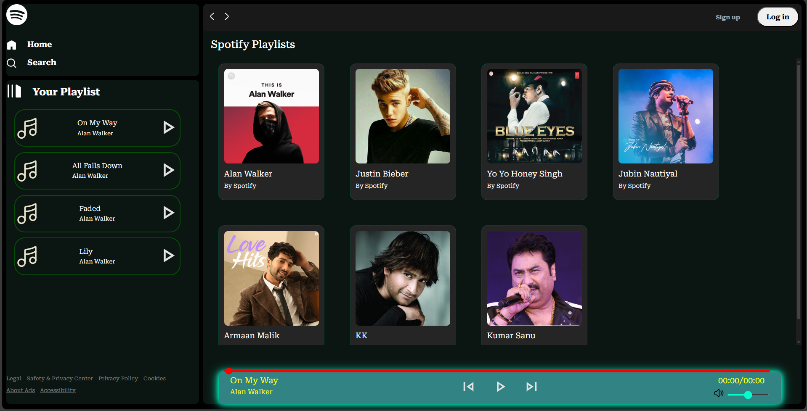
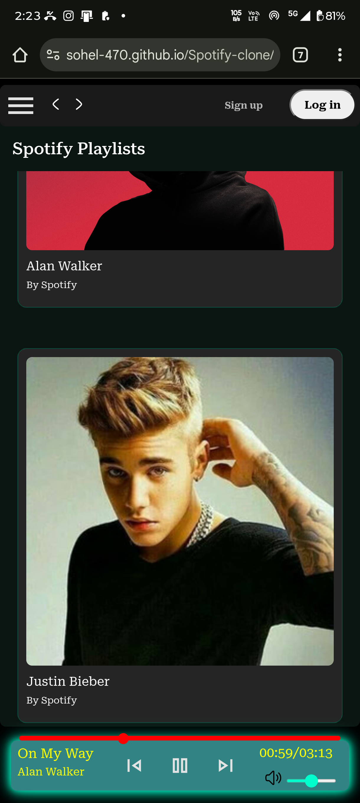

# Spotify Clone 🎵

A web-based music player application that mimics the user interface and functionality of Spotify. Built with vanilla HTML, CSS, and JavaScript, this project features a responsive design and dynamic playlist handling.

## 🚀 Live Demo
[**Click here to view the Live Site**](https://sohel-470.github.io/Spotify-clone/)

---

## ✨ Features

* **Playback Controls:** Play, pause, next, and previous functionality.
* **Seek Bar:** Interactive progress bar to seek through songs.
* **Volume Control:** Adjustable volume slider with mute functionality.
* **Dynamic Library:** Automatically fetches and lists songs from local folders.
* **Responsive Design:** Fully functional on desktop and mobile devices (includes hamburger menu).
* **Visuals:** customized scrollbars and hover effects matching the Spotify dark theme.

## 🛠️ Technologies Used

* **HTML5:** Semantic structure of the application.
* **CSS3:** Styling, Flexbox layout, and responsive media queries.
* **JavaScript (ES6):** DOM manipulation, event handling, and audio API integration.

## 📂 File Structure

```text
spotify-clone/
├── Assets/          # Icons (play, pause, volume, etc.)
├── songs/           # Music folders and JSON data
├── index.html       # Main HTML structure
├── style.css        # Styling and responsive rules
├── utility.css      # Utility classes and scrollbar styling
├── script.js        # Main game logic and audio handling
└── README.md        # Project documentation
```

## 📸 Screenshots

### Desktop View


### Mobile View


## 🔮 Future Enhancements

* [ ] **Search Functionality:** Filter songs by name or artist in real-time.
* [ ] **Keyboard Shortcuts:** Enable Spacebar to play/pause and Arrow keys to skip.
* [ ] **Song Duration Preview:** Display total duration on the card before playing.
* [ ] **Shuffle Mode:** Randomize the playlist order.

## 📄 License & Disclaimer

**This project is for educational purposes only.**

All music tracks, images, and logos used in this project are the property of their respective owners. No copyright infringement is intended. If you are a copyright holder and wish for any content to be removed, please contact the developer, and it will be removed immediately.